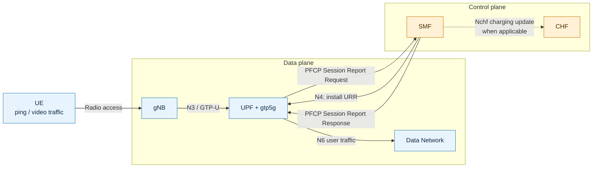
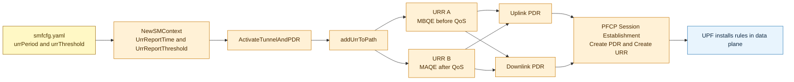
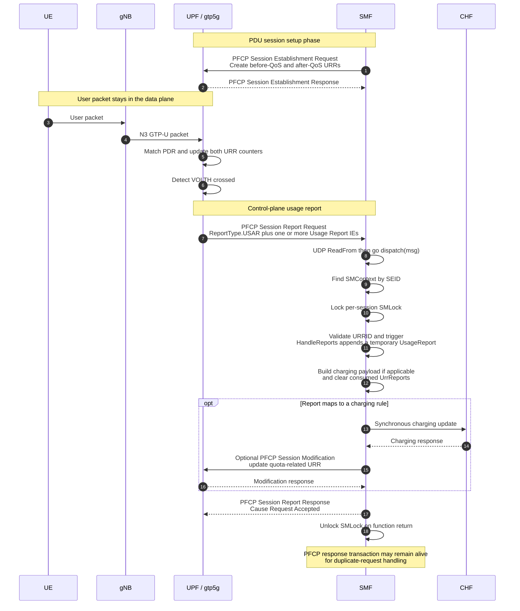
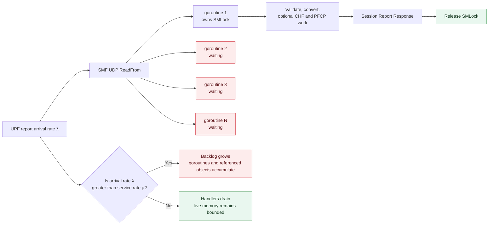
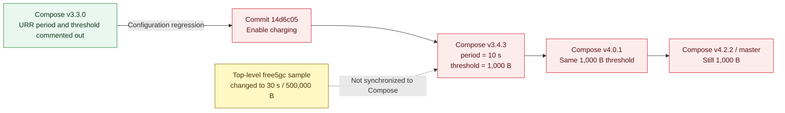
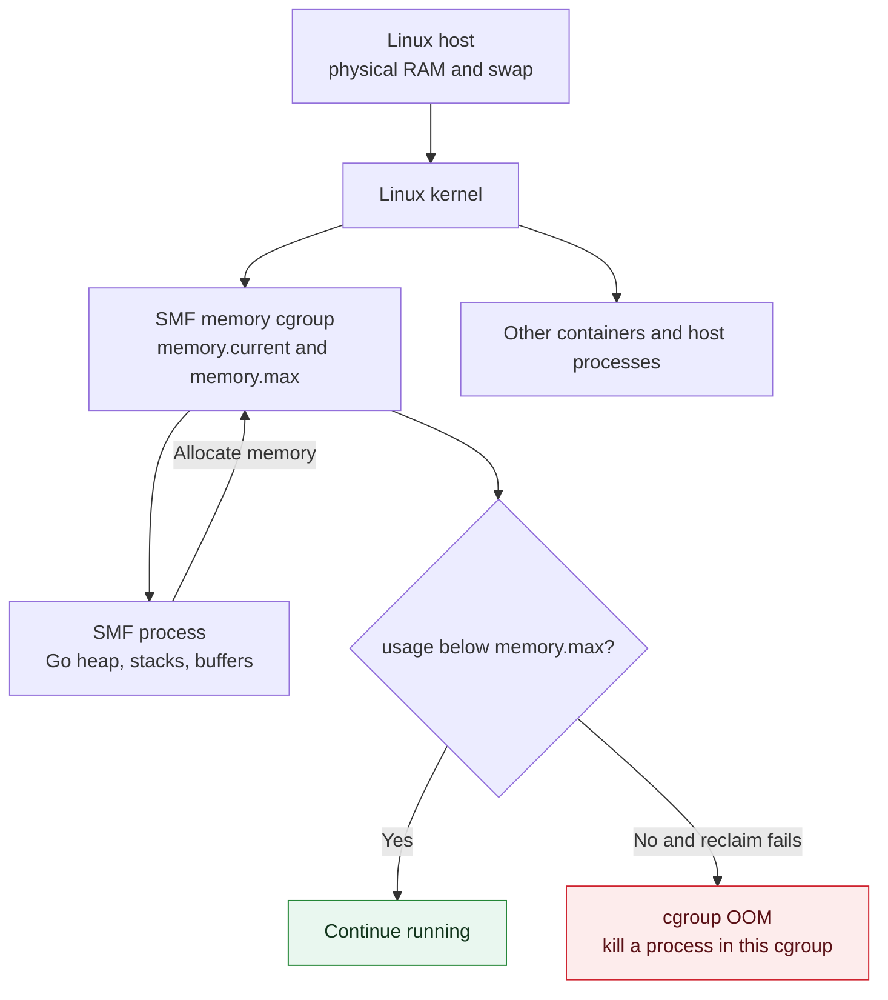
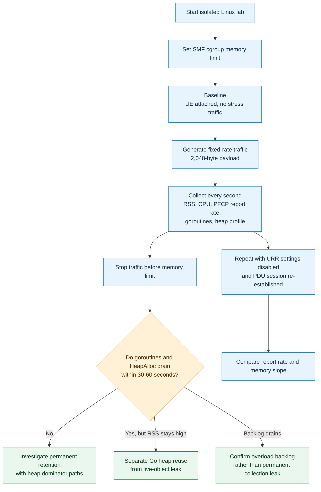
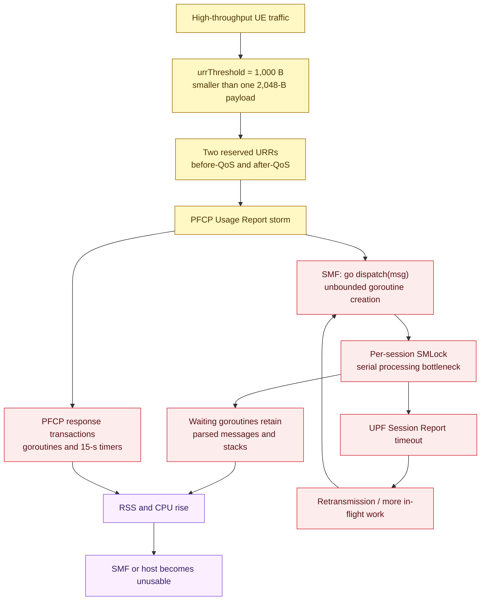
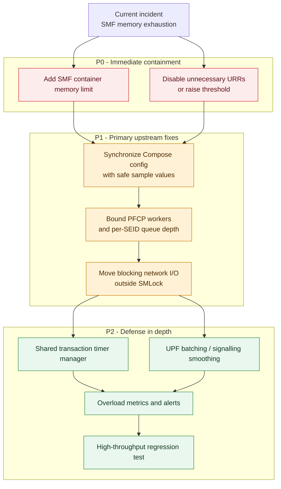
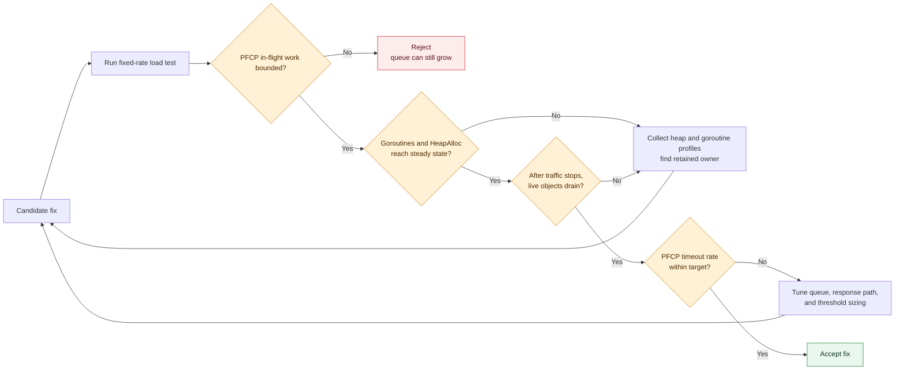

# Issue Review Report: free5gc Issue #676

## 📌 摘要

| 項目 | 內容 |
|---|---|
| Issue | [free5gc/free5gc #676: SMF holds memory until computer and core is unusable](https://github.com/free5gc/free5gc/issues/676) |
| 回報者 / 日期 | `Justin-Garey` / 2025-05-14 |
| 狀態 | Open；維護者已回覆為 known issue，但無 assignee、無關聯 PR |
| 受影響環境 | free5GC Compose v3.4.3–v4.0.1，Ubuntu 22.04/24.04 |
| 判定 | ✅ 有效的資源耗盡問題；核心是過度 PFCP Usage Report 加上 SMF 無上限並行處理造成的 unbounded backlog |
| Regression 觸發點 | `free5gc-compose` 啟用 charging 時，將 `urrThreshold` 從未啟用改為僅 `1000` bytes |
| 主要所屬 | 立即設定修正：`free5gc-compose`；根本容錯：SMF PFCP 處理路徑 |
| 驗證限制 | 本次已完成 issue/forum、release config、歷史 source 與現行 source 比對；尚未在 Linux + gtp5g + UE 環境執行 runtime pprof |

## 1. 架構與相關流程

這一張先把 data plane 與 control plane 分開。UE 的 user packet 經過 gNB 與 UPF，不會被 SMF 轉送；SMF 看到的是 UPF 依 URR 產生的 PFCP Usage Report。



問題不是 SMF 在轉送 user-plane packet。User-plane traffic 正常情況只經過 gNB 與 UPF；SMF 被壓垮的是 UPF 依 SMF 下發的 URR（Usage Reporting Rule，用量回報規則）所產生的 N4/PFCP 控制面訊息。

### 1.1 單次 Usage Report 的訊息時序

先把「單次 Usage Report」分成兩個不同時間點：

1. **PDU session 建立時**，SMF 把 URR 規則下發給 UPF。這時還沒有 Usage Report。
2. **UE 開始傳資料後**，UPF 在 data plane 計數；只要時間或流量任一 trigger 先到，就用 PFCP Session Report Request 主動回報 SMF。

因此，`urrPeriod: 30` 與 `urrThreshold: 500000` 不是「30 秒後且累積 500,000 bytes 才回報」，而是兩個獨立 trigger：

- `PERIO`：每 30 秒觸發一次。
- `VOLTH`：累積量跨過 500,000 bytes 就觸發一次。
- **哪一個先發生，UPF 就可以先送 Usage Report。** 高流量時通常是 `VOLTH` 遠早於 30 秒。

#### 1.1.1 在第一個封包之前：SMF 先建立兩條 URR

現行 `NewSMContext` 將 YAML 中的秒數與 bytes 讀進 `UrrReportTime` / `UrrReportThreshold`。建立 data path 時，`addUrrToPath` 對每個 UPF 建立兩條 reserved URR：

- `MBQE`（Measurement Before QoS Enforcement）：量測 QoS enforcement 之前的用量。
- `MAQE`（Measurement After QoS Enforcement）：量測 QoS enforcement 之後的用量。

這兩條 URR 都會掛到 uplink 與 downlink 的 PDR。PDR（Packet Detection Rule）可先理解成 UPF 用來辨識「這個封包屬於哪個 PDU session、接著套用哪些規則」的入口規則；URR 則是其中負責計數與回報的規則。



程式碼上，`addUrrToNode` 同時呼叫 `NewMeasurementPeriod(...)` 與 `NewVolumeThreshold(...)`；這兩個 helper 分別把 `ReportingTrigger.Perio` 與 `ReportingTrigger.Volth` 設為 `true`（Issue 版本可見 [`pfcp_rules.go` L64-L75](https://github.com/free5gc/smf/blob/9fef3b9cd7c9ab1255333f4a4e82f2981c170c91/internal/context/pfcp_rules.go#L64-L75)）。所以 UPF 收到的是「週期或流量 threshold 都可觸發」的 URR，而不是二選一或 AND 條件。

#### 1.1.2 一次 VOLTH 回報，線上到底發生什麼

以下假設 `urrThreshold: 1000`，UE 送出一個 payload 已超過 1,000 bytes 的封包。實際量測值由 UPF/kernel counter 決定，但光是 2,048-byte payload 就足以跨過這個門檻。



逐步解讀如下：

| 步驟  | 訊息或動作                     | 程式碼事實                                                                               | 對記憶體問題的意義                                                      |
| --- | ------------------------- | ----------------------------------------------------------------------------------- | -------------------------------------------------------------- |
| 1   | UE packet 進入 UPF          | user packet 走 gNB → UPF → DN，不經過 SMF                                                | SMF 沒有把影片或 ping payload 存進記憶體                                  |
| 2   | UPF 更新 URR counter        | 同一 UPF 有 before-QoS 與 after-QoS 兩條 reserved URR                                     | 一份 user traffic 可帶動不只一個 counter                                |
| 3   | 跨過 `VOLTH`                | UPF 產生 Session Report Request，`ReportType.USAR=1`                                   | 1,000-byte threshold 使高流量變成高頻 PFCP 控制訊息                        |
| 4   | SMF 收到 UDP request        | `internal/pfcp/udp/udp.go` 對每個 request 執行 `go dispatch(msg)`                        | 程式碼沒有 worker 數或 queue depth 上限                                 |
| 5   | 找 session 並加鎖             | handler 由 header `SEID` 找到 `SMContext`，接著取得 `SMLock`                                | 同一 PDU session 同時只能有一個 handler 通過；其餘 goroutine 在鎖前等待           |
| 6   | 轉換 Usage Report           | `HandleReports` 把 PFCP IE 轉成 Go struct，暫時 append 到 `smContext.UrrReports`           | report 在處理期間會配置/引用物件，但這個 slice 後面有清除                           |
| 7   | charging（有條件）             | 只有 URRID 能映射到 charging rule 時才組 CHF request；reserved URR 可能被判定為不計費                  | CHF 是可能的延遲來源，但不能假設 issue 中每一筆 reserved URR 都會呼叫 CHF            |
| 8   | 回覆 UPF                    | 正常路徑直到 `ReportUsageAndUpdateQuota` 後才送 Session Report Response                      | 鎖內工作越慢，UPF 越容易等到 timeout                                       |
| 9   | PFCP response transaction | 當時使用的 PFCP library 每個 response 啟動 lifecycle goroutine，response transaction 可保留 15 秒 | report storm 下，同時存活的 goroutine、timer、message 與 transaction 被放大 |

一個 PFCP Session Report Request 可以攜帶一個或多個 Usage Report IE，所以「兩條 URR」不必然等於「兩個 UDP packet」；UPF 是否把多筆 report 合併，會影響 PFCP message/s。但對 SMF 而言，IE 仍要逐筆驗證、轉換與處理。

#### 1.1.3 排隊點不是顯式 queue，而是等待中的 goroutine

`go dispatch(msg)` 代表 UDP reader 不等上一筆處理完成，就能繼續收下一筆並再開 goroutine。另一方面，每個 handler 又必須取得同一個 `SMContext.SMLock`。兩者組合成一個**隱形、無上限的排隊系統**：排隊元素不是 `chan` 裡的 struct，而是整個尚未完成的 goroutine 及其引用的 PFCP message。



這裡的基本關係是：

```text
backlog growth per second ≈ incoming PFCP reports/s - completed handlers/s
```

只要前者長期大於後者，記憶體就會繼續上升；即使每個 handler 最後都會釋放，也能先把 host 吃光。這屬於 unbounded backlog / resource exhaustion。它在操作結果上就是 memory leak，但與「某個 map 永遠不 delete」的永久 retention leak 不完全相同。

#### 1.1.4 程式碼可以確認與不能確認的事

可確認的程式碼事實：

```go
// internal/pfcp/udp/udp.go
if msg.PfcpMessage.IsRequest() {
    go dispatch(msg)
}
```

這裡沒有 semaphore、bounded channel 或 worker pool。

```go
// internal/pfcp/handler/handler.go
smContext.SMLock.Lock()
defer smContext.SMLock.Unlock()
// ... HandleReports / ReportUsageAndUpdateQuota ...
SendPfcpSessionReportResponse(...)
```

回覆與可能的 charging 處理都發生在 handler 返回、解鎖之前。Issue 版本的精確路徑可見 [`handler.go`](https://github.com/free5gc/smf/blob/9fef3b9cd7c9ab1255333f4a4e82f2981c170c91/internal/pfcp/handler/handler.go#L83-L99) 與 [report/response 區段](https://github.com/free5gc/smf/blob/9fef3b9cd7c9ab1255333f4a4e82f2981c170c91/internal/pfcp/handler/handler.go#L198-L208)。

```go
// internal/sbi/processor/charging_trigger.go
smContext.UrrReports = []smf_context.UsageReport{}
```

Issue 版本的 `buildMultiUnitUsageFromUsageReport` 也在 [`charging_trigger.go` L151-L225](https://github.com/free5gc/smf/blob/9fef3b9cd7c9ab1255333f4a4e82f2981c170c91/internal/sbi/processor/charging_trigger.go#L151-L225) 清空這個 slice。所以 `UrrReports` 不是目前程式碼中已證實的永久累積容器。若要回答「117.9 GiB 裡各有多少是 waiting goroutine、PFCP transaction、Go heap page 或其他物件」，仍必須在可重現環境取得 goroutine profile 與 heap pprof，不能只靠 source 推定精確比例。

## 2. Issue 摘要

| 項目 | 證據與解讀 |
|---|---|
| 症狀 | Issue 截圖中 SMF 使用 `117.9 GiB / 125.5 GiB`（93.91%）與約 569% CPU |
| 觸發 | UE 連線後用 2,048-byte payload 高頻 ping，或傳送視訊 |
| UPF log | 重複出現 `serveUSAReport` 與 `handleSessionReportRequestTimeout: SEID[0x1]` |
| v3.3.0 差異 | Compose v3.3.0 的 `urrPeriod` / `urrThreshold` 是註解，因此不會建立這兩個 reserved URR |
| v3.4.3 以後 | Compose 將 `urrPeriod: 10` 與 `urrThreshold: 1000` 啟用；2,048-byte ping payload 單包即大於 threshold |
| 現行狀態 | 截至 2026-08-07，issue 仍 open、無 assignee；即時檢查 Compose master 仍是 `10` s / `1000` bytes，上層 free5GC master 是 `30` s / `500000` bytes |

若單包負載為 2,048 bytes，每個 reserved URR 都可能在每包跨過 1,000-byte threshold。SMF 為 before-QoS 與 after-QoS 各建一條 URR，所以單一 PDU session 可產生極高的 report rate。例如 100 Mbit/s、2 KiB packet 約為 6,100 packets/s，兩條 URR 約為 12,200 Usage Report IE/s（實際 PFCP message 數取決於 UPF 是否批次封裝）。

### 2.1 版本 regression 時間線

版本分界不是巧合。v3.3.0 雖然已有 URR 程式碼，但 Compose 預設沒有啟用；charging commit 將 period 與 1,000-byte threshold 打開後，高流量才會穩定進入異常路徑。



## 3. 重現步驟 (Reproduction Steps)

### 3.0 cgroup 是什麼，為什麼重現前要先設定

**cgroup（control group，控制群組）是 Linux kernel 用來把一組 process 放在同一個資源帳本中，並對它們做統計與限制的機制。** 它可以管 CPU、memory、I/O 與 process 數量等資源。Docker container 不是一台有自己 kernel 的 VM；container 裡的 SMF process 仍與 host 共用 Linux kernel，Docker 只是替它建立 namespaces 與 cgroups。

因此，如果 SMF container **沒有 memory cgroup 上限**，它可以持續向 host 申請記憶體，直到其他 NF、桌面程式甚至整台主機都無法運作。Issue 截圖中的 `117.9 GiB / 125.5 GiB` 與這種 operational impact 一致。



cgroup limit 是**保險絲，不是修漏水**：它能保住 host，但 SMF 到達上限後仍可能被 cgroup OOM killer 終止，PDU session/control plane 仍會中斷。真正修復仍要降低 report rate 並限制 SMF 內部 backlog。

### 3.1 環境準備

為避免再次把主機記憶體吃光，應使用可隨時中止的隔離測試主機，並在產生流量前限制 SMF。

```bash
git clone --branch v4.0.1 --depth 1 https://github.com/free5gc/free5gc-compose.git
cd free5gc-compose
docker compose up -d
docker update --memory 1g --memory-swap 1g smf
```

這個命令把目前名為 `smf` 的 container 限為 1 GiB；`--memory-swap` 與 `--memory` 設成相同值，代表不額外提供 swap 額度。它只修改目前的 container；若 `docker compose down` 後重新建立，應把限制寫進 Compose 才可重複套用：

```yaml
services:
  free5gc-smf:
    mem_limit: 1g
    memswap_limit: 1g
```

套用後可檢查 Docker 實際記錄的 byte 值：

```bash
docker inspect smf --format 'memory={{.HostConfig.Memory}} memorySwap={{.HostConfig.MemorySwap}}'
docker stats --no-stream smf
```

不同 Docker/cgroup v1、v2 環境的底層檔案路徑不同，因此報告以 `docker inspect` / `docker stats` 作為可攜式驗證方式。不要只看到 YAML 有設定就假設限制已生效。

### 步驟 1: 確認異常設定

```bash
grep -nE 'urrPeriod|urrThreshold|requestedUnit' config/smfcfg.yaml
```

預期看到：

```text
urrPeriod: 10
urrThreshold: 1000
requestedUnit: 1000
```

### 步驟 2: 建立 UE PDU session

使用原 issue 已驗證的 OAI gNB/nrUE 或 srsRAN gNB/UE，確認 UE tunnel 能到達 N6 data network 主機。

### 步驟 3: 開啟安全監控

```bash
watch -n 1 'docker stats --no-stream smf upf chf'
```

另開終端：

```bash
docker logs -f upf 2>&1 | grep -E 'serveUSAReport|handleSessionReportRequestTimeout'
```

### 步驟 4: 產生流量

Issue 內的 `-i` 應為大寫 `-I`；`ping -I` 才是指定 tunnel interface。

```bash
ping -I <tun-interface> -A -s 2048 <reachable-N6-host>
```

### 3.2 受控重現與證據收集流程

重現的重點不是把主機再次吃到 OOM，而是用有上限的環境比較 baseline、config workaround 與 code fix。這樣才能把 report rate、goroutine backlog 與 RSS 連成同一條證據鏈。



### 預期輸出（異常行為）

- SMF RSS 與 CPU 持續上升。
- UPF log 高頻出現 `serveUSAReport`。
- SMF 處理不及後，UPF 出現 `handleSessionReportRequestTimeout`。
- 停止流量後，已累積的 goroutine/request backlog 需時間消化；Go runtime 也不保證立即將所有 heap pages 還給 OS。

### 修復後驗證

先使用「兩個值都移除/註解」的對照組，重啟 SMF 並重建 PDU session：

```yaml
# urrPeriod: 10
# urrThreshold: 1000
```

```bash
docker compose restart free5gc-smf
```

重複相同流量，預期 `serveUSAReport` 風暴與 SMF 記憶體線性成長消失。若必須保留 charging，再以較大 threshold 做第二組對照，並記錄 report/s、goroutine count 與 heap profile。

## 4. 根本原因分析

### 4.1 Regression：Compose 啟用 1,000-byte URR threshold

`free5gc-compose` commit [`14d6c05` (Feature: support charging)](https://github.com/free5gc/free5gc-compose/commit/14d6c0597917c920abb1cc57cb269cd238270b48) 同時：

- 新增/啟用 CHF。
- 把 `#urrPeriod: 10` 改成 `urrPeriod: 10`。
- 把 `#urrThreshold: 1000` 改成 `urrThreshold: 1000`。
- 新增 `requestedUnit: 1000`。

這是回報中 v3.3.0 與 v3.4.3 行為分界的直接解釋。Compose [v3.3.0 config](https://github.com/free5gc/free5gc-compose/blob/v3.3.0/config/smfcfg.yaml#L91-L93) 未啟用 URR；[v4.0.1 config](https://github.com/free5gc/free5gc-compose/blob/v4.0.1/config/smfcfg.yaml#L91-L95) 則啟用 10 s / 1,000 bytes。

上層 `free5gc` repo 其實早已在 [commit `42f1b86`](https://github.com/free5gc/free5gc/commit/42f1b86cba0ffa879cd8621b198f82416aa7ee7f) 將 sample 改為 30 s / 500,000 bytes，但 Compose 沒有同步；[v4.2.2](https://github.com/free5gc/free5gc-compose/blob/v4.2.2/config/smfcfg.yaml#L91-L95) 與 2026-08-07 即時檢查的 [Compose master](https://github.com/free5gc/free5gc-compose/blob/main/config/smfcfg.yaml) 都仍是 10 s / 1,000 bytes，而 [free5GC master sample](https://github.com/free5gc/free5gc/blob/main/config/smfcfg.yaml) 是 30 s / 500,000 bytes。

### 4.2 SMF 程式碼的放大機制

SMF v3.4.2 image 對應的 SMF source commit 為 `9fef3b9` (SMF v1.2.4)。程式路徑為：

1. [`internal/context/datapath.go`](https://github.com/free5gc/smf/blob/9fef3b9cd7c9ab1255333f4a4e82f2981c170c91/internal/context/datapath.go#L351-L404) 對每個 data-path node 建立 before-QoS 與 after-QoS 兩條 reserved URR，將 `UrrReportThreshold` 填入 Volume Threshold。
2. [`internal/pfcp/udp/udp.go`](https://github.com/free5gc/smf/blob/9fef3b9cd7c9ab1255333f4a4e82f2981c170c91/internal/pfcp/udp/udp.go#L54-L76) 對每個 PFCP request 直接 `go dispatch(msg)`，沒有 worker limit 或 bounded queue。
3. [`HandlePfcpSessionReportRequest`](https://github.com/free5gc/smf/blob/9fef3b9cd7c9ab1255333f4a4e82f2981c170c91/internal/pfcp/handler/handler.go#L83-L99) 取得 per-session `SMLock`，而 Usage Report 處理與 response 都在鎖內完成。當 arrival rate 高於處理率，新 goroutine 會無上限等鎖。
4. 同一 handler 在 [L198-L208](https://github.com/free5gc/smf/blob/9fef3b9cd7c9ab1255333f4a4e82f2981c170c91/internal/pfcp/handler/handler.go#L198-L208) 先處理 report/charging，最後才回 PFCP response；backlog 一旦形成，UPF 更容易 timeout/retry。
5. 當時的 `github.com/free5gc/pfcp v1.0.7` 對每個 response 再開一個 goroutine，並保留 response transaction 15 秒來回應 retransmission：[`pfcpUdp/udp.go`](https://github.com/free5gc/pfcp/blob/v1.0.7/pfcpUdp/udp.go#L145-L166)、[`transaction.go`](https://github.com/free5gc/pfcp/blob/v1.0.7/transaction.go#L114-L140)。這不是永久 map leak，但在 report storm 下會大幅增加同時存活的 goroutine、timer、message buffer 與 transaction。

下圖把這些程式點串成一個放大回路。第一個問題是 threshold 太小，第二個問題是 SMF 沒有 bounded admission control；當 timeout 開始出現，retry 又會讓壓力更高。



因此，最精確的定義是「組態觸發的 PFCP report storm + SMF unbounded work backlog」。它在運維上是真實的 memory exhaustion bug，但目前證據不足以把 117.9 GiB 全部歸因於某個「永久不刪除的 Go collection」。

### 4.3 日誌如何對應到程式流程

- `serveUSAReport`：go-UPF 已從 gtp5g 取得 Usage Report，正在建立 PFCP Session Report Request。
- `handleSessionReportRequestTimeout`：go-UPF 發出 request 後沒有在 retransmission window 內收到可配對的 response。
- 兩者在高流量時連續出現，與 SMF handler queue 飽和的預期現象一致。

需補上 pprof 才能完全定案的證據：

- `runtime.NumGoroutine()` 是否與 RSS 同步線性上升。
- goroutine profile 是否主要堵在 `SMContext.SMLock.Lock` 與 `StartSendingResponse`。
- heap profile 是否主要由 `pfcpUdp.Message`、`Transaction`、timer 與 goroutine stack 持有。
- 停止流量並等待 30–60 秒後，`HeapAlloc`、goroutine count 與 RSS 各自下降多少。

## 5. 受影響檔案

### 設定檔

| Repo / 檔案 | 影響 |
|---|---|
| `free5gc-compose/config/smfcfg.yaml` | 主要 regression；啟用 `urrPeriod: 10` / `urrThreshold: 1000` |
| `free5gc/config/smfcfg.yaml` | 上層 sample 已是 30 / 500000，與 Compose 不一致 |
| `free5gc-compose/docker-compose.yaml` | 掛載上述 config 到 SMF container，所以實際執行的是 Compose 值 |

### SMF source

| 檔案 | 影響 |
|---|---|
| `internal/context/sm_context.go` | 將 config 的 period/threshold 複製到每個 `SMContext` |
| `internal/context/datapath.go` | 建立 before/after QoS reserved URRs |
| `internal/pfcp/udp/udp.go` | 每 request 開 unbounded goroutine |
| `internal/pfcp/handler/handler.go` | per-session 鎖下處理 Usage Report，最後才 response |
| `internal/context/pfcp_reports.go` | 將 PFCP Usage Report 轉成 `SMContext.UrrReports` |
| `internal/sbi/processor/charging_trigger.go` | 消費 report，必要時同步呼叫 CHF/更新 quota |

### Library / UPF

| 檔案 | 影響 |
|---|---|
| `free5gc/pfcp/pfcpUdp/udp.go` | 每個 response 建立 transaction goroutine |
| `free5gc/pfcp/transaction.go` | response transaction 每次等 15 s，放大同時存活資源 |
| `go-upf/internal/pfcp/report.go` | 產生 `serveUSAReport` 日誌與 Session Report Request |
| `go-upf/internal/pfcp/transaction.go` | timeout 後產生 issue 中的 timeout 日誌 |

## 6. 建議修復方案

### 6.1 立即 workaround

先直接回答：**如果目標是先讓 free5gc-compose sample 不再那麼容易重現 #676，改成 `30` s / `500000` bytes 是合理的第一步；如果目標是完整修好 memory exhaustion，只有這一項不夠。**

| 問題 | 答案 |
|---|---|
| 是否應把 Compose 的 `10 / 1000` 對齊上層 sample `30 / 500000`？ | **是。** 它能大幅降低目前最危險的預設 report rate |
| 改完是否代表任何流量、session 數都安全？ | **否。** 500,000 bytes 仍會在高 throughput 下頻繁觸發 |
| `30 s` 是否會限制每秒最多一份 report？ | **否。** `VOLTH` 可以在 30 秒內觸發很多次 |
| 是否修掉 `go dispatch(msg)` 的無上限並行？ | **否。** 異常 UPF、更多 session 或更高流量仍可製造 backlog |
| 是否還需要 cgroup limit？ | **需要。** 它是保護 host 的最後一道防線 |

如果根本不需要 usage reporting/charging，最乾淨的對照與 workaround 是同時移除或註解兩個值：

```diff
-  urrPeriod: 10
-  urrThreshold: 1000
+  # urrPeriod: 10
+  # urrThreshold: 1000
```

不建議只把其中一個改為 `0`；現行 `NewMeasurementPeriod(0)` / `NewVolumeThreshold(0)` 仍會設定 trigger flag，但 builder 不會加入對應 IE，會形成難以預期的 URR。

修改後必須重啟 SMF，並重建 PDU session，讓新的 URR 重新透過 PFCP 下發；只改檔案、不重建既有 session，不足以證明舊規則已消失。

若必須保留 usage reporting，至少先與上層 sample 對齊：

```diff
-  urrPeriod: 10
-  urrThreshold: 1000
+  urrPeriod: 30
+  urrThreshold: 500000
```

這只改 `urrPeriod` 與 `urrThreshold`；`requestedUnit: 1000` 是 charging requested unit，語意不同，不應因為 threshold 改成 500,000 就機械式改成相同數字。

#### 為什麼 500,000 bytes 仍不一定安全

忽略 batching，先用最簡單的上限估算：

```text
volume-trigger Usage Report IE/s
≈ active sessions × measured URRs per session × bytes/s per session ÷ threshold bytes

periodic Usage Report IE/s
≈ active sessions × periodic URRs per session ÷ period seconds
```

以單一 session、100 Mbit/s、兩條 reserved URR 為例：

| 設定 | 每條 URR 的 volume trigger 估算 | 兩條 URR 的 Usage Report IE 估算 |
|---|---:|---:|
| `1000` bytes | raw bytes/threshold 約 12,500 次/s；但 2,048-byte packet 測試約受 6,100 packet/s 限制 | 依 issue 的 2 KiB packet 模型約 12,200 IE/s |
| `500000` bytes | 約 25 次/s | 約 50 IE/s |

若是 1 Gbit/s，`500000` bytes 對兩條 URR 的估算會上升到約 500 IE/s。若同時有 100 個相似 session，還要再乘上 session 數。實際 PFCP UDP message/s 可能因多個 Usage Report IE 合併而較低，但 SMF 仍需處理各 IE。

因此 500,000 bytes 只是現有 sample 的合理同步值，不是所有部署的安全常數。若先決定整個 SMF 最多接受 `target_report_IE_rate`，threshold 至少應依壓力模型反推：

```text
threshold bytes
>= active sessions × measured URRs per session × per-session bytes/s
   ÷ target total Usage Report IE/s
```

最後仍須用預期最大 session 數與 throughput 做 load test，觀察 PFCP report/s、goroutine count、heap/RSS 與 UPF timeout。建議落地順序是：

1. Compose sample 先改成 `30 / 500000`，並在註解寫清楚 sizing 關係。
2. SMF container 加 memory cgroup limit，避免單一 NF 拖垮 host。
3. 重啟 SMF、重建 PDU session，再以最大預期負載驗證。
4. 另做 SMF 根本修復：bounded worker/per-SEID queue、縮短 `SMLock` critical section、限制 PFCP transaction 同時存活量。

### 6.2 上游設定修正

1. 修正 `free5gc-compose/config/smfcfg.yaml`，不再將 1,000 bytes 當作一般用途預設值。
2. 在 config 註解明確說明 threshold 與 PFCP signalling rate 的關係。
3. 新增 compose smoke/load test：在固定 throughput 下驗證 SMF RSS 與 goroutine count 會穩定。

### 6.3 SMF 根本容錯修正

1. 不要對每個 PFCP request 直接開無上限 goroutine；改為 bounded worker pool 或 per-SEID bounded queue。
2. 縮小 `SMLock` critical section，不要在鍵內執行可能阻塞的 CHF/PFCP network I/O。
3. 確認 PFCP Session Report Response 能否在基本 validation 後先回，charging/quota update 改由 bounded asynchronous pipeline 處理。
4. 在 PFCP library 取消「每個 response transaction 一個 goroutine + `time.After`」，改用共用 timer wheel/scheduler 或有上限的 transaction manager。
5. 新增 overload metrics：PFCP request rate、in-flight handlers、per-SEID queue depth、dropped/retried reports、goroutine count。

### 6.3.1 本次 go-pfcp refactor 的落地狀態（2026-08-11）

新 PFCP foundation 已在 `internal/pfcp/server.go` 實作第一層根本防護：

- 使用固定大小的 dispatch worker pool；worker 同步呼叫 handler，不再對每筆 request 執行 `go dispatch(...)`。數量由 `configuration.pfcp.dispatchWorkerCount` 設定，省略或 `0` 時預設為 `64`，validation 上限為 `1024`。
- `dispCh` 維持 4,096 筆的固定容量；滿載後拒絕新工作，不讓 backlog 轉移成無上限 goroutine。
- dispatch queue 滿時立即停止並移除該 request 的 `RxTransaction`，避免留下只會等待 timer 的孤兒 transaction；UPF 之後重送時仍可重新 admission。
- queue item 直接攜帶建立當下的 `RxTransaction`；worker 執行前必須 claim。若 queue 等待期間 timer 已到期，舊 item 只會被 dequeue 丟棄，不會誤綁後續相同 key 的 retransmission，也不會執行 stale handler。
- claim 後暫停 Rx queue timer，避免長時間 handler 在處理途中被清除；response 送出後從該時間重設 duplicate-response cache timer。shutdown 仍可強制停止 transaction。
- 新增 concurrency regression test，使用阻塞 handler 證明同時執行數不超過 worker 數。
- 新增 overflow 與 stale-queue regression tests，分別證明拒絕 dispatch 後 `rxTrans` 不殘留，以及逾時 queue item 不會進入 handler。

這項修改把記憶體成長從「隨輸入持續無上限增加」改成由 receive queue、dispatch queue 與 worker 數共同限制。它目前只存在於 refactor 後的新 `PfcpServer` foundation；在 SMF runtime 尚未由舊 `internal/pfcp/udp` 切換過去以前，既有執行路徑仍有 #676 的原始漏洞。

尚未完成的第二層工作包括：per-SEID fairness/queue、縮小 `SMLock` critical section、將可能阻塞的 CHF/PFCP I/O 移出鎖，以及在真實 UPF/charging workload 下量測 goroutine、heap、drop/retry 與 PFCP timeout。固定 worker pool 解決的是資源無上限成長；它不保證超載時沒有封包丟棄或 timeout。

### 6.4 修復層次與優先順序

這個問題不應只在一層處理。Config fix 能立即降低 incident rate，但只有 bounded SMF pipeline 才能保證未來的錯誤設定、大量 session 或異常 UPF 不會再把系統壓垮。



## 7. 3GPP 合規性說明

3GPP TS 29.244 將 URR 定義為 CP function（這裡是 SMF）安裝給 UP function（UPF）的用量量測/回報規則。當設定的 volume threshold 被跨越，UPF 發送 Usage Report 是預期行為；PFCP Session Report Request 也正是 UPF 在 N4 上向 SMF 回報 session information 的標準訊息。參見 [ETSI TS 129 244 V16.6.0, §5.2.2.3.1 與 §7.5.8](https://www.etsi.org/deliver/etsi_ts/129200_129299/129244/16.06.00_60/ts_129244v160600p.pdf)。

所以：

- UPF 依 1,000-byte URR 高頻回報，本身不足以判定為 gtp5g 違規。
- 1,000-byte sample 對高流量不具擴展性，是部署預設與實作容錯問題。
- TS 29.244 也提醒 UP function 在大量 Usage Report 時需平滑 signalling load；因此 go-UPF 加入 batching/rate smoothing 是合理的 defense-in-depth，但不應取代 SMF/Compose 修正。

## 8. 影響評估

| 項目 | 評估 |
|---|---|
| 嚴重度 | High；單一 UE 高流量可使 SMF/host OOM 或失去回應 |
| 機密性/完整性 | 未見直接影響 |
| 可用性 | 明確受影響；可造成 core 不可用與主機重啟 |
| 觸發條件 | 啟用極低 URR threshold + 持續 user-plane traffic |
| 受影響版本 | 已回報 v3.4.3–v4.0.1；靜態分析顯示 Compose v4.2.2/master 仍保留相同觸發設定 |
| 暫時解法 | 停用 reserved URR，或大幅提高 threshold；對 SMF 設 container memory limit |
| 修復複雜度 | Config fix: Low；SMF bounded/concurrent redesign: Medium–High |
| 安全邊界 | 在可控 UE 或 user-plane 流量來源的部署中，可被當成 availability/DoS 風險 |

## 9. Issue 品質評估

| 項目 | 評估 | 備註 |
|---|---|---|
| Bug 描述 | 優 | 版本邊界、現象與緩解版本清楚 |
| 環境資訊 | 普通 | 有 OS/release，但缺 Docker、kernel、gtp5g、go-UPF 精確版本 |
| 重現步驟 | 良好 | `ping` 的 interface option 應修正為 `-I` |
| 預期行為 | 良好 | 明確指出 SMF 不應用完系統記憶體 |
| 日誌 | 不足 | Issue 本體無 log；forum 補上 UPF timeout，但無 SMF full log |
| 記憶體 profile | 缺少 | 無 heap/goroutine pprof，無 traffic rate/report rate/time series |
| 截圖 | 有用 | 顯示 117.9 GiB RSS 與高 CPU，但只是單一時點 |

## 10. 結論

### ✅ 已確認的部分

- Issue 回報的 SMF resource exhaustion 是有效 bug，且維護者也已標記為 known issue。
- Regression 與 Compose charging commit 直接對應：v3.3.0 未啟用 URR，v3.4.x 啟用 1,000-byte threshold。
- 2,048-byte ping 單包大於 threshold，會產生 report storm。
- SMF 對 PFCP request 無上限開 goroutine，同一 session 又以 `SMLock` 序列化，存在明確的 unbounded backlog 條件。
- PFCP response transaction 的 15-second goroutine/timer 生命週期會進一步放大記憶體與 CPU 壓力。
- 問題不是「SMF 正常需要儲存所有 user-plane traffic」；這不是合理設計。
- 截至本次檢查，Compose 的 1,000-byte 預設與既有 SMF runtime 的 unbounded dispatch 仍存在；本次 refactor foundation 已加入 bounded dispatch，但尚未切換 runtime。

### 📋 建議執行事項

- [ ] 先對 `free5gc-compose` 送 config PR，至少對齊 30 s / 500,000 bytes，並說明 sizing 方法。
- [ ] 在可控記憶體上限的 Linux lab 重現，收集 heap/goroutine pprof。
- [ ] 記錄 PFCP report/s、goroutine count、in-flight response transactions 與 per-SEID waiters。
- [ ] 由 SMF team 實作 bounded PFCP dispatch，並縮小 `SMLock` 範圍。
- [ ] 由 PFCP library team 改成有上限的 response transaction/timer 管理。
- [ ] 新增 high-throughput regression test，驗證停止流量後 goroutine/heap 會回落並穩定。

### 10.1 修復驗收門檻

最後不能只看「沒有 OOM」。真正的驗收條件是在固定 workload 下，report admission 有上限、goroutine 與 heap 會進入 steady state，停止流量後 live objects 會回落，而 PFCP timeout 不會持續出現。



## 11. 建議回覆 (Suggested GitHub Comment)

以下為可直接貼到 GitHub Issue 的回覆內容：

---

> Hi @Justin-Garey, thanks for the report and the reproducible traffic pattern.
>
> **Confirmed:** this is a real SMF resource-exhaustion issue. The strongest code/config evidence points to a PFCP Usage Report storm and an unbounded SMF work backlog, rather than the SMF intentionally retaining user-plane packets.
>
> The regression boundary matches the charging configuration change in `free5gc-compose`. In v3.3.0, `urrPeriod` and `urrThreshold` were commented out. The charging update enabled:
>
> ```yaml
> urrPeriod: 10
> urrThreshold: 1000
> requestedUnit: 1000
> ```
>
> A 2,048-byte ping payload exceeds the 1,000-byte threshold on every packet. The SMF installs reserved before-QoS and after-QoS URRs, so high-throughput traffic can cause a very high PFCP Session Report Request rate. This also explains the repeated UPF logs:
>
> ```text
> serveUSAReport
> handleSessionReportRequestTimeout
> ```
>
> ### Root cause
>
> `internal/pfcp/udp/udp.go` starts an unbounded goroutine for every PFCP request (`go dispatch(msg)`). `HandlePfcpSessionReportRequest` then serializes reports for the same PDU session with `SMLock` and sends the PFCP response only after report/charging processing. If the report arrival rate exceeds the serialized processing rate, waiting goroutines, parsed PFCP messages, timers, and response transactions accumulate until the SMF/host runs out of memory.
>
> The old and current `free5gc/pfcp` response path also keeps one response transaction goroutine/timer alive for up to 15 seconds, which amplifies the number of live objects during a report storm.
>
> ### Affected files
>
> - `free5gc-compose/config/smfcfg.yaml`
> - `smf/internal/context/datapath.go`
> - `smf/internal/pfcp/udp/udp.go`
> - `smf/internal/pfcp/handler/handler.go`
> - `pfcp/pfcpUdp/udp.go`
> - `pfcp/transaction.go`
>
> ### Workaround
>
> If usage reporting/charging is not required, comment out both settings, restart the SMF, and re-establish the PDU session:
>
> ```yaml
> # urrPeriod: 10
> # urrThreshold: 1000
> ```
>
> If usage reporting is required, raising the values to the top-level free5GC sample (`urrPeriod: 30`, `urrThreshold: 500000`) greatly reduces the immediate signalling rate, but the threshold should be sized for the expected aggregate throughput and number of sessions.
>
> A complete fix should also bound PFCP request concurrency/queue depth, avoid blocking network work while holding the per-session lock, and add a high-throughput regression test with goroutine and heap profiles. A heap and goroutine pprof captured during reproduction would help confirm the exact allocation split, but it is not necessary to establish the report-storm/backlog defect.
